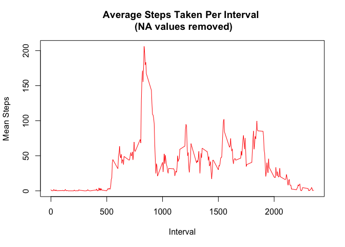
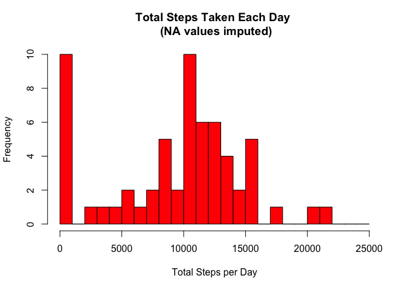
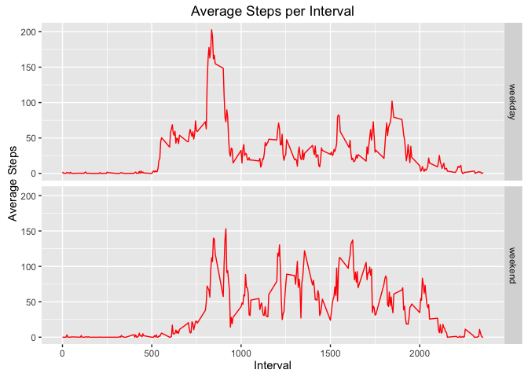

# Reproducible Research: Peer Assessment 1
Shohei Narron  
December 20, 2015  


## Loading and preprocessing the data
Show any code that is needed to:
1. Load the data (i.e. read.csv())

```r
if(!file.exists("activity.csv")){
  unzip("activity.zip")
}

activityDataRaw <- read.csv("activity.csv")
```

2. Process/transform the data (if necessary) into a format suitable for your analysis

```r
# Created new dataframe from raw activity csv.
activityDF <- data.frame(activityDataRaw)

# Format date
activityDF$date <- as.POSIXct(activityDF$date, format="%Y-%m-%d")
```


## What is mean total number of steps taken per day?
1. Calculate the total number of steps taken per day

```r
totalStepsPerDay <- aggregate(activityDF$steps,
                              by=list(activityDF$date),
                              FUN=sum,
                              na.rm=TRUE)

names(totalStepsPerDay) <- c("date","totalSteps")
```

2. If you do not understand the difference between a histogram and a barplot, research the difference between them. Make a histogram of the total number of steps taken each day

```r
hist(totalStepsPerDay$totalSteps,
     col=2,
     breaks=seq(from=0,to=25000,by=1000),
     main="Total Steps Taken Each Day \n (NA values removed)",
     xlab="Total Steps per Day",
     ylab="Frequency")
```

 

3. Calculate and report the mean and median of the total number of steps taken per day

```r
meanStepsIgnoreNA <- mean(totalStepsPerDay$totalSteps)
medianStepsIgnoreNA <- median(totalStepsPerDay$totalSteps)
```
Mean results: **9354**
Median results: **10395**


## What is the average daily activity pattern?

1. Make a time series plot (i.e. type = "l") of the 5-minute interval (x-axis) and the average number of steps taken, averaged across all days (y-axis)

```r
# Calculate mean steps taken by interval
meanStepsPerInterval <- aggregate(activityDF$steps,
                                  by=list(activityDF$interval),
                                  FUN=mean,
                                  na.rm=TRUE)
names(meanStepsPerInterval) <- c("interval","meanSteps")

# Plot timeseries
plot(x=meanStepsPerInterval$interval,
     y=meanStepsPerInterval$meanSteps,
     type='l',
     col=2,
     main="Average Steps Taken Per Interval \n (NA values removed)",
     xlab="Interval",
     ylab="Mean Steps")
```

 

2. Which 5-minute interval, on average across all the days in the dataset, contains the maximum number of steps?

```r
meanStepsPerInterval$interval[which(meanStepsPerInterval$meanSteps == max(meanStepsPerInterval$meanSteps))]
```
Answer: **835**


## Imputing missing values
1. Calculate and report the total number of missing values in the dataset (i.e. the total number of rows with NAs)

```r
# Count the number of NA values.
countNA <- length(activityDF$steps[which(is.na(activityDF$steps))])
```
Number of NAs: **2304**

2. Devise a strategy for filling in all of the missing values in the dataset. The strategy does not need to be sophisticated. For example, you could use the mean/median for that day, or the mean for that 5-minute interval, etc.

```r
# Find out where the NAs are.
pos_NA <- which(is.na(activityDF$steps))

# Calculate the median of steps taken across all days and intervals.
medianSteps <- median(activityDF$steps,na.rm=TRUE)
```
Our strategy uses the median step count taken across all days and intervals to impute missing values.

3. Create a new dataset that is equal to the original dataset but with the missing data filled in.

```r
activityDFImputed <- activityDF
activityDFImputed$steps[pos_NA] <- medianSteps
```

4. Make a histogram of the total number of steps taken each day and Calculate and report the mean and median total number of steps taken per day. Do these values differ from the estimates from the first part of the assignment? What is the impact of imputing missing data on the estimates of the total daily number of steps?

```r
# Calculate the total step count per day.
totalStepsPerDateImputed <- aggregate(activityDFImputed$steps,
                                      by=list(activityDFImputed$date),
                                      FUN=sum)

names(totalStepsPerDateImputed) <- c("date","totalSteps")

# Create a histogram of total steps taken per day.
hist(totalStepsPerDateImputed$totalSteps,
     col=2,
     breaks=seq(from=0,to=25000,by=1000),
     main="Total Steps Taken Each Day \n (NA values imputed)",
     xlab="Total Steps per Day",
     ylab="Frequency")
```

 

```r
# Calculate the mean and median values of steps taken across all days and intervals.
meanStepsImputed <- mean(totalStepsPerDateImputed$totalSteps)
medianStepsImputed <- median(totalStepsPerDateImputed$totalSteps)
```
The mean step count per day with imputed values is **9354** compared to **9354**, the mean step count per day ignoring NA values.

The median steps per day with imputed values is **10395** compared to **10395**, the median step count per day ignoring NA values.

Results from the imputed data set match the results obtained by ignoring NA values.

## Are there differences in activity patterns between weekdays and weekends?

#### For this part the weekdays() function may be of some help here. Use the dataset with the filled-in missing values for this part.

1. Create a new factor variable in the dataset with two levels – “weekday” and “weekend” indicating whether a given date is a weekday or weekend day.

```r
activityDFImputed$dayOfWeek <- weekdays(activityDFImputed$date)

# Add new column "designation" to assign the values "weekend" and "weekday"
activityDFImputed$designation <- ifelse(activityDFImputed$dayOfWeek == "Saturday" | activityDFImputed$dayOfWeek == "Sunday", "weekend", "weekday")

# Coerce designation to factor type.
activityDFImputed$designation <- as.factor(activityDFImputed$designation)
```

2. Make a panel plot containing a time series plot (i.e. type = "l") of the 5-minute interval (x-axis) and the average number of steps taken, averaged across all weekday days or weekend days (y-axis). See the README file in the GitHub repository to see an example of what this plot should look like using simulated data.

```r
library(ggplot2)
```

```
## Warning: package 'ggplot2' was built under R version 3.2.3
```

```r
# Calculate the mean step count per interval, by weekday/ weekend designation.
meanStepsPerIntervalByDesignation <- aggregate(activityDFImputed$steps,
                                               by=list(activityDFImputed$designation,
                                                       activityDFImputed$interval),
                                               FUN=mean)

names(meanStepsPerIntervalByDesignation) <- c("designation","interval","meanSteps")

# Create a timeseries plot using the ggplot2 package.
ggplot <- ggplot(data=meanStepsPerIntervalByDesignation,
                 aes(x=interval,y=meanSteps))+
  geom_line(col=2)+
  facet_grid(designation ~ .)+
  labs(title="Average Steps per Interval")+
  xlab("Interval")+
  ylab("Average Steps")
  
ggplot
```

 

